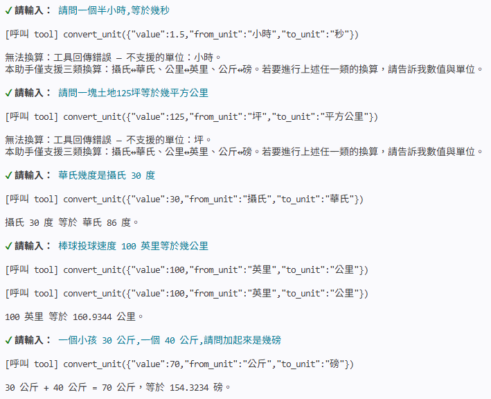

# 作業 2：單位換算工具

> AI Agent 實作工作坊（JavaScript 版）
> 基底分支：`2.5-tool-calling-current-time`

參考課程的天氣工具，新增一個「單位換算」工具，讓 AI 透過 Function Calling 進行單位換算。

## 一、工具說明（`convert_unit`）

| 項目 | 內容 |
|---|---|
| name | `convert_unit` |
| description | 進行單位換算 |
| parameters | `value`（數字）、`from_unit`（字串）、`to_unit`（字串） |

支援三類**雙向**換算（換算公式寫在本地，精確且可重現）：

| 類別 | 換算 | 公式／常數 |
|---|---|---|
| 溫度 | 攝氏 ↔ 華氏 | °F = °C × 9/5 + 32 |
| 距離 | 公里 ↔ 英里 | 1 km = 0.621371 mile |
| 重量 | 公斤 ↔ 磅 | 1 kg = 2.20462 lb |

- 單位名稱可用中文、英文或縮寫（如 `攝氏`/`C`、`公里`/`km`、`公斤`/`kg`）。
- 遇到不支援的單位、或跨類別換算（例如公斤換公里），回傳錯誤物件 `{ error: "..." }`。

## 二、檔案結構

```
main.js                互動聊天主程式（串接工具的 Function Calling 迴圈）
tools/convert_unit.js  單位換算工具（JSON Schema 定義 + 換算實作）
tools/index.js         工具註冊中心
utils/func-tool.js     工具定義與轉成 OpenAI tool 的工具函式
lib/openai.js          OpenAI client 與預設模型
db/messages.js         對話記憶（支援 tool 訊息）
test/convert_unit.test.js  換算邏輯測試（離線可跑）
```

## 三、執行方式

```bash
npm install
cp .env.example .env      # 填入你的 OPENAI_API_KEY
npm start
```

啟動後直接用自然語言提問即可，例如：

- `25 度 C 是華氏幾度？`
- `10 公里等於幾英里？`
- `70 公斤是幾磅？`

輸入 `exit` 結束。

離線驗證換算邏輯（不需金鑰）：

```bash
npm test
```

測試涵蓋：三組雙向換算、回傳欄位、單位容錯、不支援單位與跨類別的錯誤處理。

## 四、對話紀錄

查詢範例：

```
請輸入：25 度 C 是華氏幾度？

[呼叫 tool] convert_unit({"value":25,"from_unit":"攝氏","to_unit":"華氏"})

25 攝氏度等於 77 華氏度。

請輸入：10 公里等於幾英里？

[呼叫 tool] convert_unit({"value":10,"from_unit":"公里","to_unit":"英里"})

10 公里約等於 6.2137 英里。

請輸入：70 公斤是幾磅？

[呼叫 tool] convert_unit({"value":70,"from_unit":"公斤","to_unit":"磅"})

70 公斤約等於 154.3234 磅。
```
實際查詢結果：




